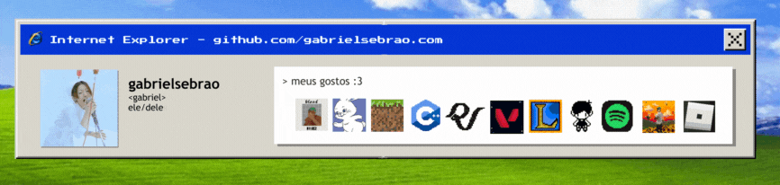

## gabriel de oliveira sebrao 

 ***Aprendiz Industrial de Back-End na Intelbras e Senai***  Ténico em Desenvolvimento de Sistemas SESI/SENAI   3° Ano do Ensino Médio   17 anos
## **Ferramentas**

## **Linguagens**

## **Redes sociais**
<a href="https://instagram.com/gabwlfgrl" target="_blank" style="text-decoration: none;"> 
<a href="https://open.spotify.com/user/ofq3ca0anjo3wx75yndohtm88" target="_blank" style="text-decoration: none;">
<a href="https://www.last.fm/pt/user/omorismt" target="_blank" style="text-decoration: none;"> 
<a href="https://br.pinterest.com/gabrielsebrao/" target="_blank" style="text-decoration: none;"> 
<a href="https://www.duolingo.com/profile/kelsmt" target="_blank" style="text-decoration: none;"> 

